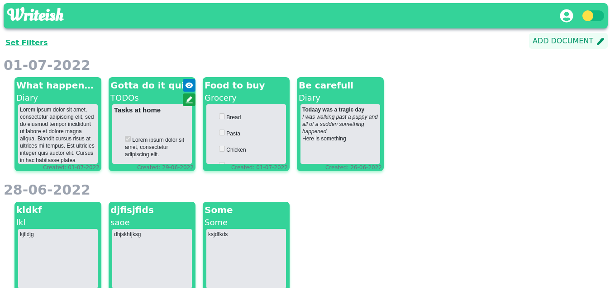
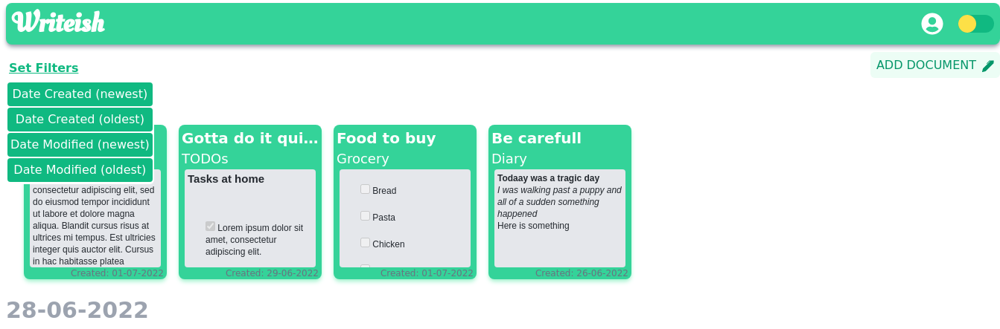
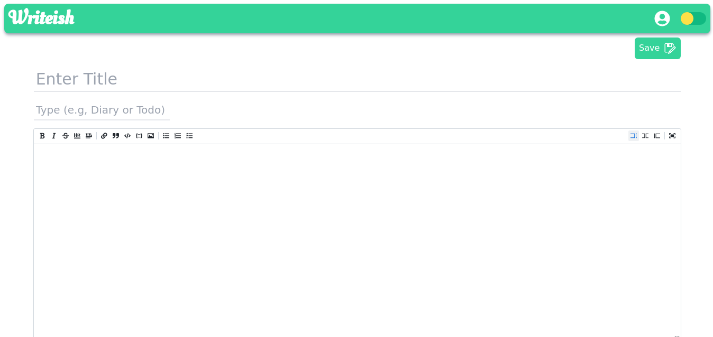
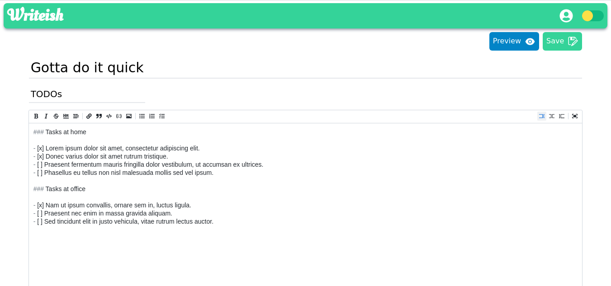
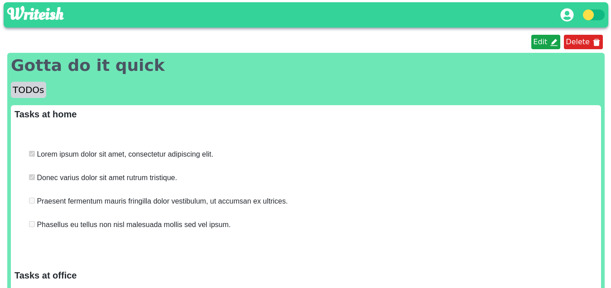
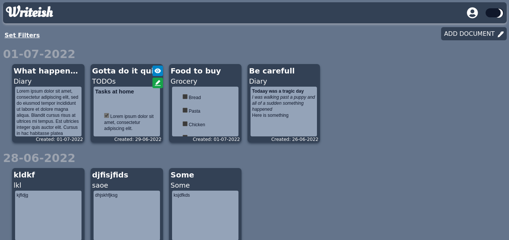
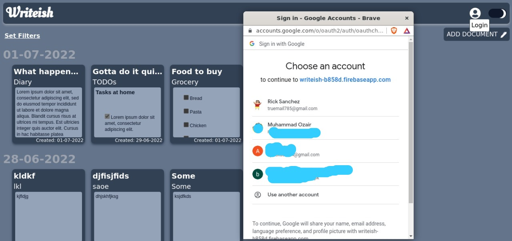
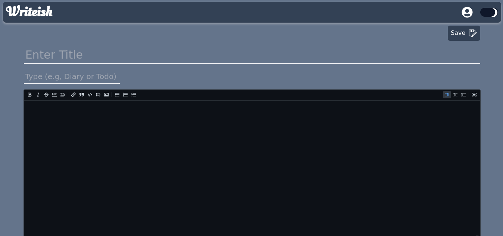
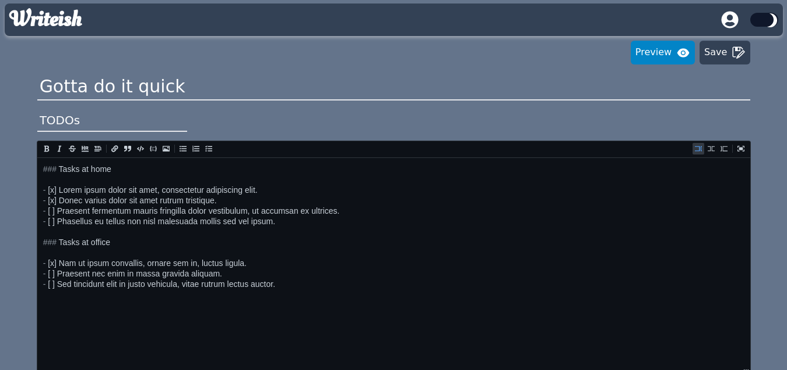
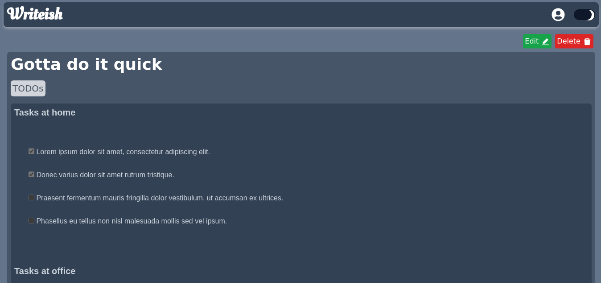

# React - Note taking App

## Technologies Used
  - React
  - React-Redux
  - React-router
  - Firebase
  - TailwindCSS
  - Vite (build tool)
---
## Features
  - User can take notes of any type. e.g, Diary, todos, grocery list etc.
  - Markdown is supported
  - User can login with Google to store his notes in database and access them from any device
  - Edit and Preview documents
  - User can sort his documents based on ` Date Created ` and ` Date Modified ` filters.
  - Night mode is supported
---

## Run locally

Step 1. Clone the project
```
  git clone <SSH url>
  cd ./writeish
```

Step 2. Install dependencies

```
  npm install
```

Step 3. Run project

```
  npm run dev
```

---
# Previews

## Home Page


## Sort Documents


## New Document


## Edit Document


## Preview Document


# Night Mode Previews



## Google Authentication







